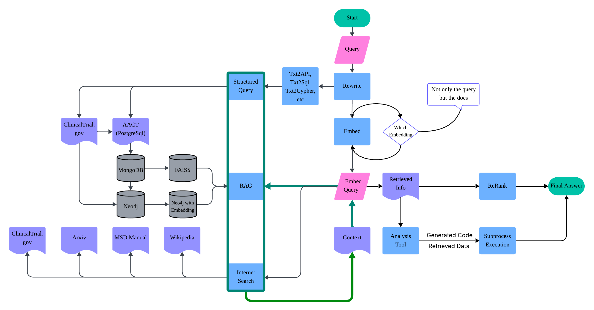

## HippoView

An AI-powered clinical trial explorer

1. Knowledge graph
    - From AACT(a relational database for clinical trial) and through ETL to build knowledge graph with graph database(neo4j)
2. GraphRAG
    - based on knowledge graph to build GraphRAG (langchain, DSPy)
3. Agent
    - based on GraphRAG, build a multi-agent structure to retreive data and generate code for the analysis or straight to execute it and return results. (langchain, DSPy)

Pilot: A subset of AACT db　

Dairy:
* May 6: 
    - running into issues when try trial2vec, mostly due to cuda
    - how to do json data embedding is a problem -> json2markdown/json2str
        * json data here is not involved in nested relationship, so embed the json struture or not should not affect performance too much

* May 14:
    - how to save spaces for mongodb? Need a way to best link Clinical Trials and its embedding&document. Strike a balance between space usage and complete info.
    - Rewrite probably could use NER to extract medical terms?
    - for now, manually bring up the mongodb and neo4j service and load data. Probably later this could be automated by docker-compose yaml.